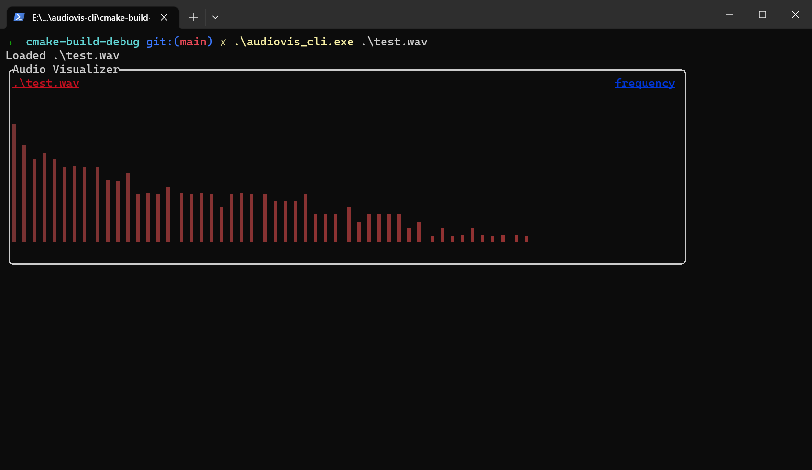
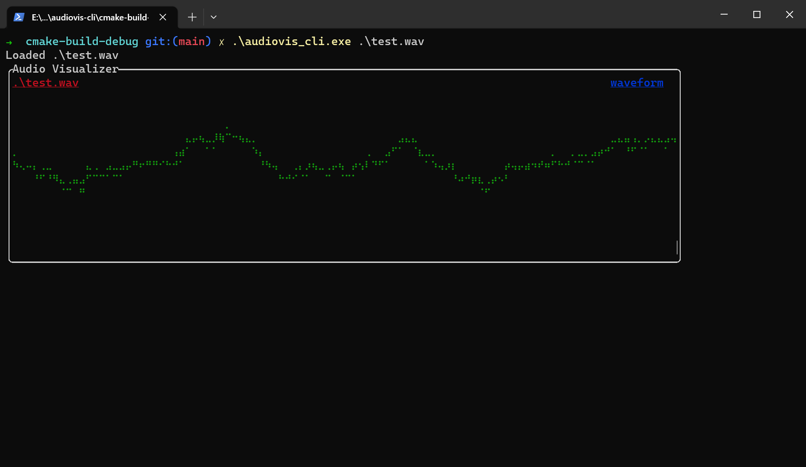

# audiovis-cli

Audio visualizer in command line

# screenshots

# Inspiration

- https://github.com/karlstav/cava
- https://developer.mozilla.org/en-US/docs/Web/API/Web_Audio_API/Visualizations_with_Web_Audio_API
